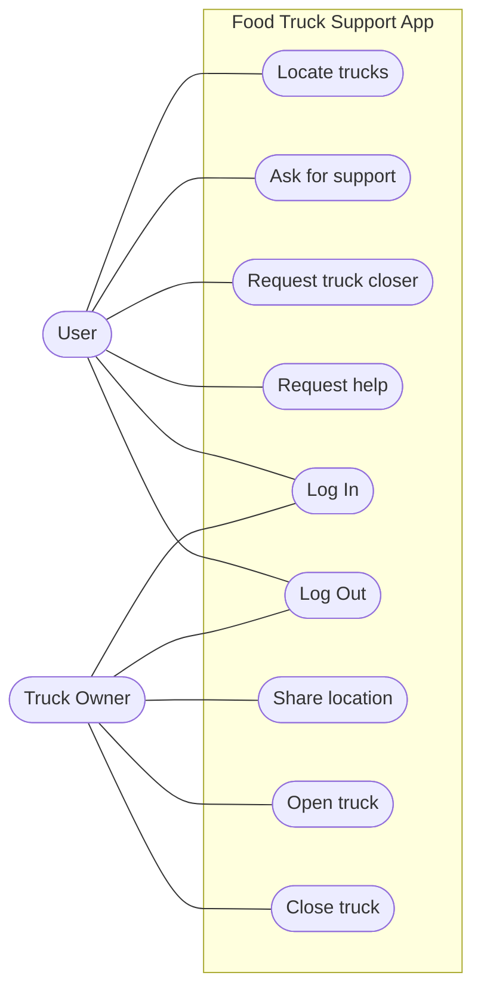

```mermaid
graph LR
  actor1(["User"])
  actor2(["Truck Owner"])
 
  subgraph system["Food Truck Support App"]
    UC1(["Locate trucks"])
    UC2(["Ask for support"])
    UC3(["Request truck closer"])
    UC4(["Request help"])
    UC5(["Log In"])
    UC6(["Log Out"])
    
    UC7(["Share location"])
    UC8(["Open truck"])
    UC9(["Close truck"])
  end
 
  actor1 --- UC1
  actor1 --- UC2
  actor1 --- UC3
  actor1 --- UC4
  actor1 --- UC5
  actor1 --- UC6
 
  actor2 --- UC5
  actor2 --- UC6
  actor2 --- UC7
  actor2 --- UC8
  actor2 --- UC9
```
